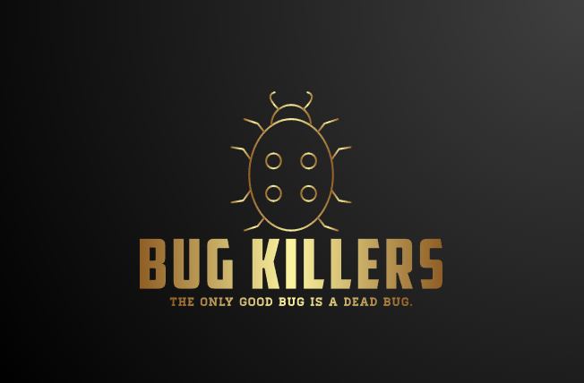

# UORDEL

## Descripción

"Uordle" es un juego de palabras, su objetivo es adivinar una palabra secreta de letras variables en el menor número de intentos posible. El juego te da seis oportunidades para adivinar la palabra y te dará pistas cada vez que lo intentes.

## Requerimientos

- [Node.js](https://nodejs.org/en)
- [Jest](https://jestjs.io/docs/getting-started)

### Opcionales

- [CodeMetrics](https://marketplace.visualstudio.com/items?itemName=kisstkondoros.vscode-codemetrics)
- [Jest](https://marketplace.visualstudio.com/items?itemName=Orta.vscode-jest)

## Instalación

Ejecute el siguiente comando que puede usar en la terminal
```bash
git clone https://github.com/BMB0/Pruebas-de-Unidad-y-Cobertura-de-C-digo && cd Pruebas-de-Unidad-y-Cobertura-de-C-digo && npm install --save-dev jest
```

## Uso

#### Para instalar las dependencias
```bash
npm install
```

#### Comandos de uso
Ejecutar web-sever local parcel
```bash
npm start
```
Ejecutar pruebas de unidad de forma continua --watch
```bash
npm test
```
Ejecutar pruebas de unidad solo una vez
```bash
npm run test-once
```
Opcionalmente puede ejecutar las pruebas de unidad automáticamente usando la extensión [Jest](https://marketplace.visualstudio.com/items?itemName=Orta.vscode-jest).
